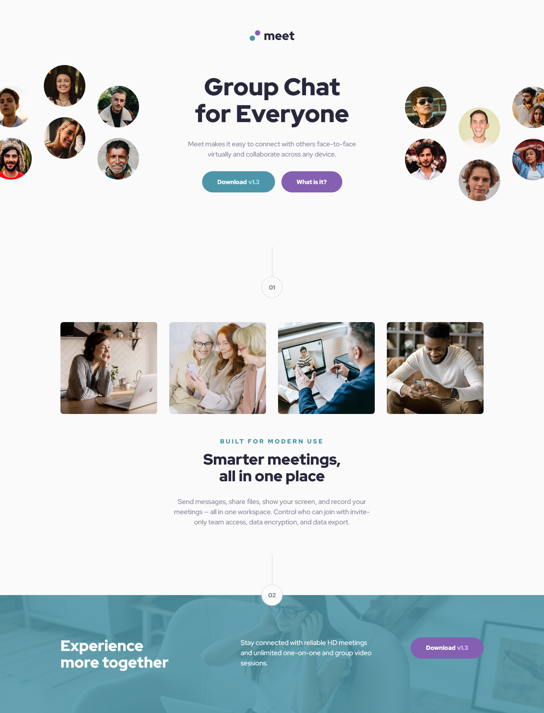

# Frontend Mentor - Meet landing page solution

This is a solution to the [Meet landing page challenge on Frontend Mentor](https://www.frontendmentor.io/challenges/meet-landing-page-rbTDS6OUR). Frontend Mentor challenges help you improve your coding skills by building realistic projects.

## Table of contents

- [Overview](#overview)
  - [The challenge](#the-challenge)
  - [Screenshot](#screenshot)
  - [Links](#links)
- [My process](#my-process)
  - [Built with](#built-with)
  - [What I learned](#what-i-learned)
  - [Continued development](#continued-development)
- [Author](#author)

## Overview

### The challenge

Users should be able to:

- View the optimal layout depending on their device's screen size
- See hover states for interactive elements

### Screenshot



### Links

- Solution URL: [View solution on Frontend Mentor](https://www.frontendmentor.io/solutions/responsive-meet-landing-page-made-with-flexbox-and-grid-4_EQ9IKWej)
- Live Site URL: [View Live Site](https://alexander3717.github.io/MeetLandingPage/)

## My process

### Built with

- Semantic HTML5 markup
- BEM methodology
- SASS features
- Flexbox
- CSS Grid
- Mobile-first workflow

### What I learned

You can easily apply tint to a background image using `linear-gradient`:

```scss
.footer__hero {
    background-image: 
        linear-gradient(rgba(77, 150, 169, 0.85), rgba(77, 150, 169, 0.85)),
        url("assets/tablet/image-footer.jpg");
}
```

Here, by using the same color at both ends of the gradient, you create a single-color overlay. Because `background-image` layers "images" in the order you specify them, the tint sits on top of the image.

I also learned that if you need to center an image and crop its sides symmetrically when the viewport gets too narrow, you have to:

- give image `max-width: none`
- horizontally center the image within its container
- horizontally center the container itself
- apply `overflow: hidden` to that container

Without `overflow: hidden`, the cropping becomes uneven for some reason.

While working on the desktop design I also got a bit more experience using CSS Grid and practiced some absolute positioning with pseudo-elements when making the decorative step nodes.

### Continued development

In past challenges I mostly handled responsiveness by creating two breakpoints and making them match the corresponding Figma design. But I didn't pay much attention to screen sizes between those breakpoints. I just made sure the layout stayed mostly the same until the next jump.

For future projects, I’d like to move more towards fluid responsiveness. Instead of fixing font sizes at breakpoints I want to try using the clamp() function so that the font sizes scale smoothly between screen sizes too. Same for things like images, containers, and spacing — I want to see if I can make them feel more adaptable, rather than just snapping from one layout to another.

## Author

- Frontend Mentor - [@Alexander3717](https://www.frontendmentor.io/profile/Alexander3717)
